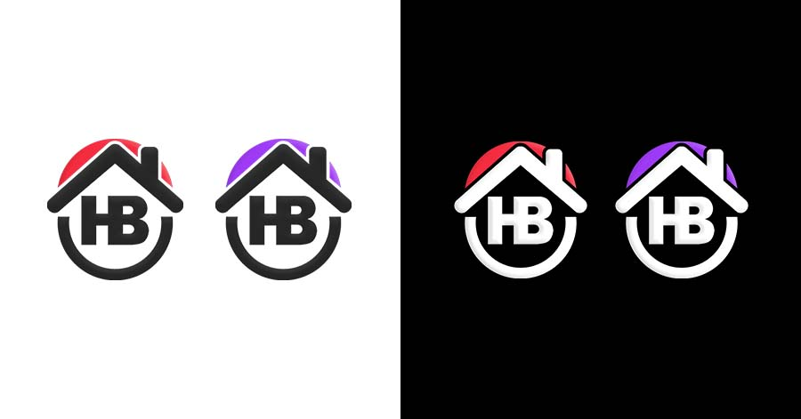
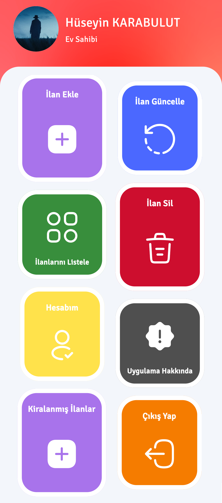
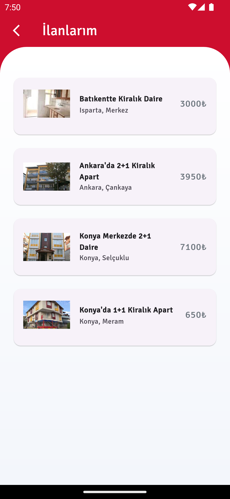
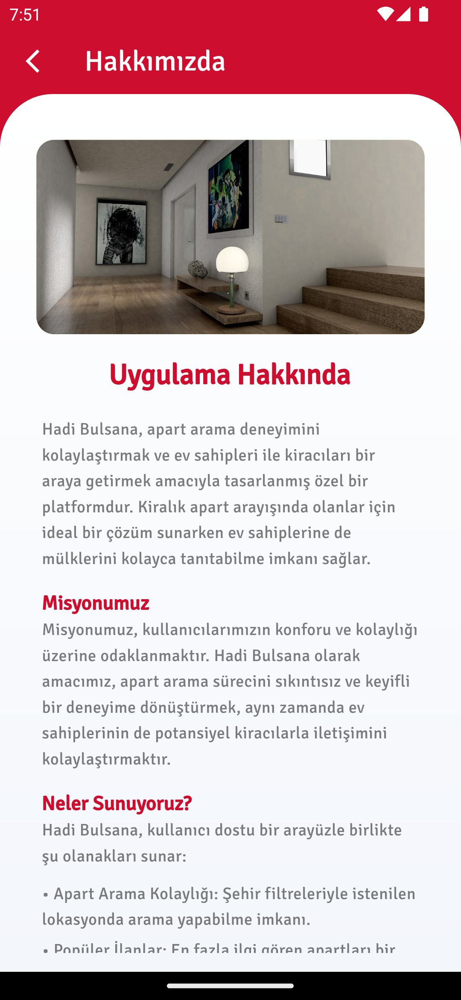
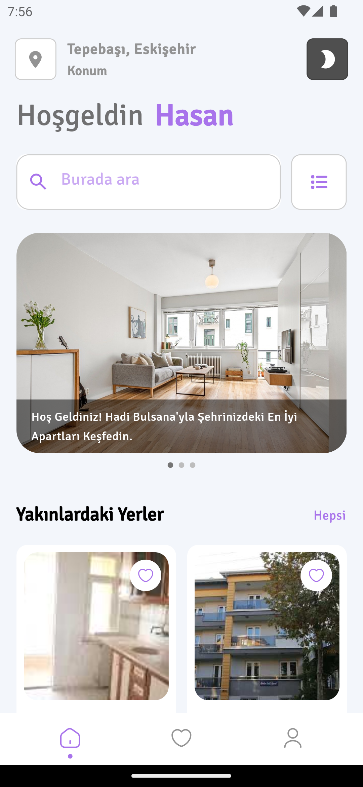
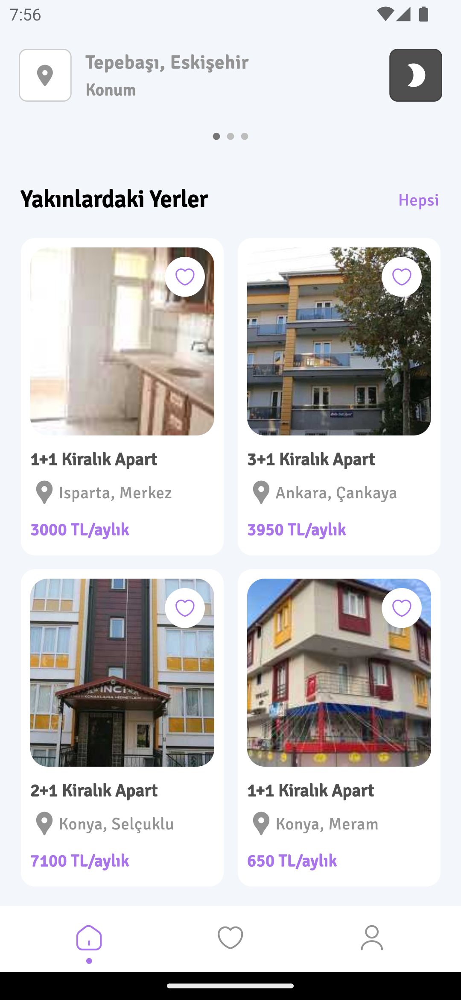
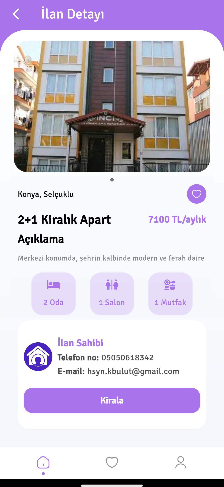

# Hadi Bulsana: Apart Bulma Uygulaması
**Hadi Bulsana**, apart arayan kiracılar ve apartlarını kiraya vermek isteyen ev sahipleri arasında bir platform sağlayan bir apart bulma uygulamasıdır. Uygulama, Flutter kullanılarak dart programlama diliyle geliştirilmiştir. Uygulama, kullanıcıların ilanları filtreleyebilmeleri, ev kiralayabilmeleri ve kişisel bilgilerini yönetebilmeleri gibi işlevlere sahiptir.

## Özellikler
- **Kiracı İşlevleri:**
  - Kayıt Olma, Giriş Yapma, Şifre Değiştirme
  - Şehir Bilgisi Girme ve İlan Görüntüleme
  - Kişisel Bilgileri Görüntüleme/Değiştirme
  - Yardım ve Diğer Sayfaları Görüntüleme

- **Ev Sahibi İşlevleri:**
  - Kayıt Olma, Giriş Yapma, Şifre Değiştirme
  - İlan Ekleme/Silme/Güncelleme/Listeleme
  - Kişisel Bilgileri Görüntüleme/Değiştirme
  - Yardım ve Diğer Sayfaları Görüntüleme

### Proje Sunumu:
- **BİLGİ**: Bu dosyada uygulamamın proje sunum raporu yer almaktadır. İnceleyebilirsiniz:  
[Proje Sunum Raporu](Project-Presentation/ProjeRaporSunumu.pdf)

## Uygulama Ekran Görüntüleri
<table>
  <tr>
    <td>1</td>
     <td>2</td>
     <td>3</td>  
  <tr>
    <td></td>
    <td></td>
    <td></td>   
 </table>

<table>
  <tr>
    <td>4</td>
     <td>5</td>
     <td>6</td> 
  <tr>
    <td></td>
    <td></td>
    <td></td>
 </table>
  
<table>
  <tr>
    <td>7</td>
     <td>8</td>
     <td>9</td> 
  <tr>
    <td></td>
    <td></td>
    <td></td>
 </table>

## Uygulama Tanıtım Videosu
https://github.com/hsynkbulut/Hadi-Bulsana/assets/106428623/2867b8a8-52dc-4ab5-b8bd-432c49703a0c

---

## Uygulama Geliştiricisi
Bu uygulama, [Hüseyin Karabulut](https://github.com/hsynkbulut) tarafından geliştirilmiştir. Bana ulaşmak için [e-mail](mailto:hsyn.kbulut@gmail.com) adresime e-posta gönderebilirsiniz. Uygulama ile ilgili geri bildirimlerinizi, önerilerinizi veya sorunlarınızı bana iletebilirsiniz. Uygulamayı kullandığınız için teşekkür ederim 😊

## İletişim
Eğer herhangi bir sorunuz, öneriniz veya geri bildiriminiz varsa, bana aşağıdaki kanallardan ulaşabilirsiniz:
- LinkedIn: [LinkedIn Profilim](https://www.linkedin.com/in/hsynkbulut/)
- Medium: [Medium Profilim](https://medium.com/@hsynkbulut)
- E-posta: [E-mail adresim](mailto:hsyn.kbulut@gmail.com)

## Lisans
Bu proje [Apache lisansı](LICENSE) altında lisanslanmıştır. Detaylı bilgi için lisans dosyasını inceleyebilirsiniz.

Bu projenin ticari kullanımı, [Hüseyin Karabulut](https://github.com/hsynkbulut)'un açık yazılı izni olmadan yasaktır. Ticari amaçla kullanmak isteyenlerin projenin sahibiyle iletişime geçmeleri gerekmektedir.
